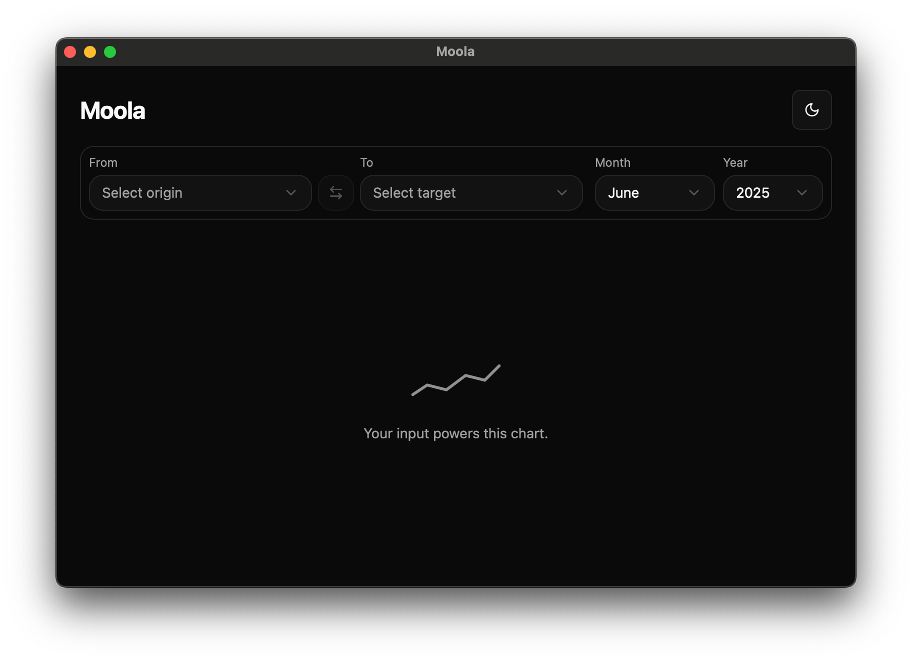
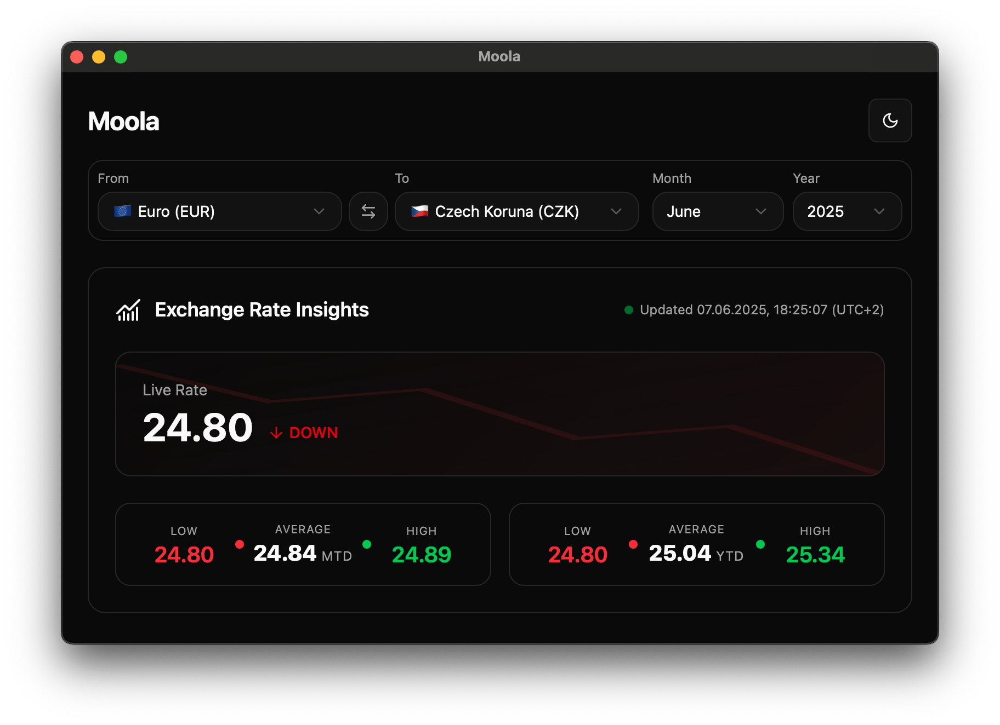

# Moola — Currency Rate Parser with Beautiful UI

  
*A sleek cross-platform desktop app built with Rust, Tauri, Vue, and shadcn/ui.*

---

## About the Project

**Moola** is a desktop application designed to monitor currency exchange rates with detailed statistics:

- Current rate
- MTD (Month-to-Date) — performance since the start of the month
- YTD (Year-to-Date) — performance since the start of the year
- Historical data

The app combines a Rust backend parser with a modern Vue 3 frontend using shadcn/ui components for a clean, responsive, and attractive user interface. Tauri powers the native cross-platform capabilities with minimal resource usage.

---

## Why I Built This

This project was born out of a real need — my father needed a reliable currency tracking tool for his work. Existing solutions were either inadequate or too bulky. I decided to build exactly what was needed to help him and anyone else looking for a sleek, efficient currency tracker.

---

## Technologies Used

- **Rust** — core parsing and business logic  
- **Tauri** — lightweight native desktop app framework  
- **Vue 3** — reactive frontend framework  
- **shadcn/ui** — UI components for a modern and elegant interface  

---

## Features

- Real-time currency rates  
- Comparison charts for MTD and YTD trends  
- Historical rate graphs and tables  
- Lightweight and responsive design  
- No browser dependencies, fast and reliable  

---

## License

This project is licensed under the MIT License — see the LICENSE file for details.